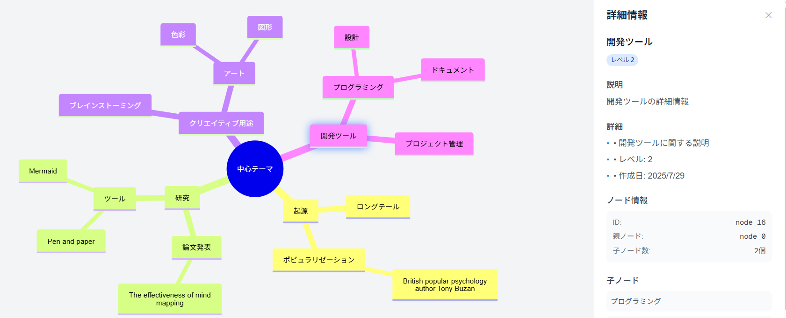

# Interactive Mindmap Application

🧠 Next.js + Mermaid.jsによるインタラクティブなマインドマップアプリケーション



## 概要

Streamlitでのクリックイベント取得の課題を解決し、Mermaid.js nativeアプローチで実装したインタラクティブなマインドマップ可視化ツールです。ノードクリックで詳細情報をサイドバーに表示し、リアルタイムでMermaidコードを編集できます。

## 技術スタック

- **フレームワーク**: Next.js 14 (App Router)
- **描画ライブラリ**: Mermaid.js
- **状態管理**: Zustand
- **スタイリング**: Tailwind CSS
- **言語**: TypeScript

## 主要機能

✅ **実装済み機能**
- Mermaid形式テキストの直接描画
- ノードクリックによるインタラクティブ操作
- リアルタイムサイドバー詳細表示
- エラーハンドリング
- レスポンシブデザイン
- TypeScript完全対応

## ディレクトリ構成

```
/src
  /app
    page.tsx                 # メインページ
  /components  
    MermaidRenderer.tsx      # Mermaid描画コンポーネント
    MermaidEditor.tsx        # テキスト入力エディタ
    DetailsSidebar.tsx       # 詳細表示サイドバー
  /store
    mindmapStore.ts          # Zustand状態管理
  /lib
    mermaidParser.ts         # Mermaidパーサー
  /types
    mindmap.ts              # TypeScript型定義
```

## セットアップ・起動

### 1. 依存関係のインストール

```bash
npm install
```

### 2. 開発サーバーの起動

```bash
npm run dev
# または
yarn dev
# または
pnpm dev
# または
bun dev
```

### 3. ブラウザでアクセス

[http://localhost:3000](http://localhost:3000) でアプリケーションを確認できます。

## 使用方法

1. **マインドマップ表示**: デフォルトでMermaid形式のマインドマップが表示されます
2. **ノードクリック**: 任意のノードをクリックすると、右側のサイドバーに詳細情報が表示されます
3. **エディタモード**: 「エディタを表示」ボタンでMermaidコードを直接編集できます
4. **リアルタイム更新**: コード変更は即座にマインドマップに反映されます

## 核心技術実装

### Mermaidレンダリングとクリックイベント

```typescript
// MermaidRenderer.tsx の核心部分
const renderMermaid = async () => {
  const { svg } = await mermaid.render(id, mermaidCode);
  containerRef.current.innerHTML = svg;
  addClickEventListeners(); // SVGノードにクリックイベントを追加
};

const addClickEventListeners = () => {
  const nodes = containerRef.current.querySelectorAll('.mindmap-node, .node');
  nodes.forEach((node) => {
    node.addEventListener('click', (event) => {
      const nodeText = node.querySelector('text')?.textContent;
      setSelectedNode(nodeText); // Zustand storeで状態管理
    });
  });
};
```

### 状態管理

```typescript
// mindmapStore.ts
export const useMindmapStore = create<MindmapStore>((set, get) => ({
  selectedNodeId: null,
  mermaidInput: `mindmap
  root((中心テーマ))
    起源
      ロングテール
    研究
      論文発表`,
  
  setSelectedNode: (nodeId: string | null) => set({ selectedNodeId: nodeId }),
  parseMermaidForNodeData: (mermaidText: string) => { /* パースロジック */ }
}));
```

## パフォーマンス最適化

- **ちらつき解決**: CSS transitionを軽量なopacityエフェクトに変更
- **重複防止**: イベントリスナーの重複追加を防止する仕組み
- **軽量レンダリング**: Mermaid.js nativeによる高速描画

## 開発・デプロイ

### ビルド

```bash
npm run build
```

### Lint

```bash
npm run lint
```

### Vercelデプロイ

[](https://vercel.com/new?utm_medium=default-template&filter=next.js&utm_source=create-next-app&utm_campaign=create-next-app-readme)

## 技術的解決課題

このプロジェクトは以下の技術課題を解決しています：

1. **Streamlitでのクリックイベント取得問題** → Next.js + DOM操作による解決
2. **Mermaidパーサーの親子関係構築** → インデント解析アルゴリズムの改良
3. **CSS Animationによるちらつき** → 軽量エフェクトとアニメーション無効化
4. **イベントリスナー重複** → フラグベースの重複防止

詳細な実装過程は `tech-blog.md` を参照してください。

## ライセンス

MIT License
